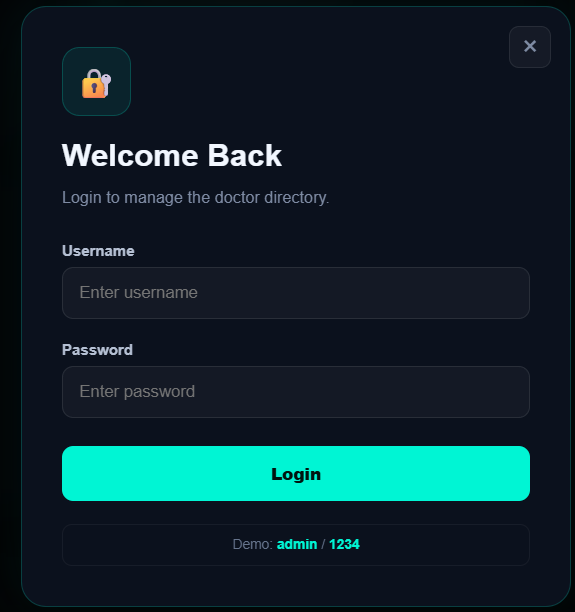
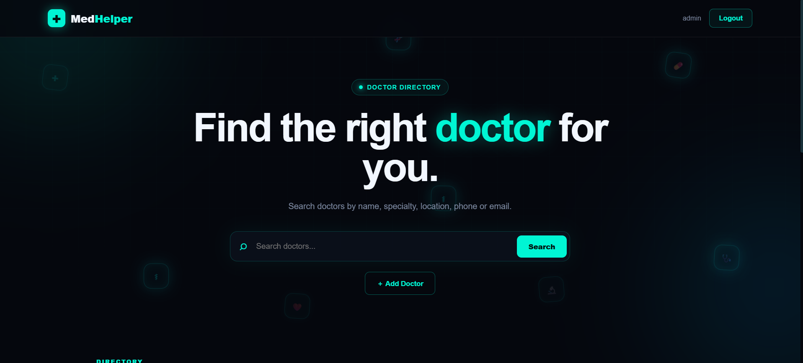
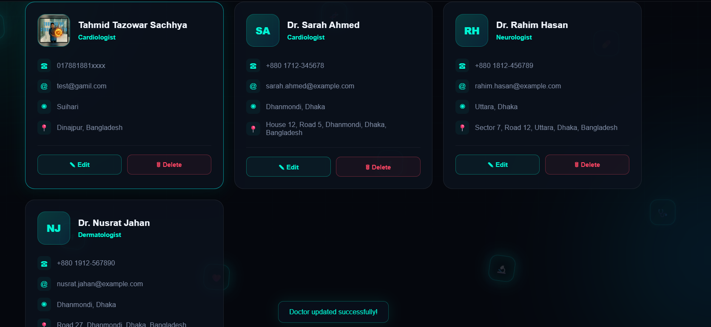
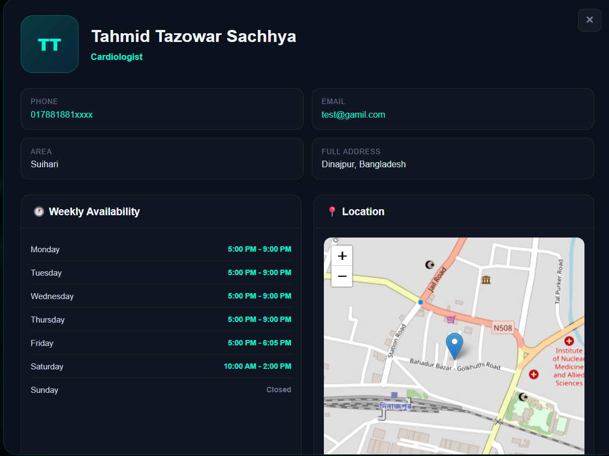

# 🩺 Med Helper

> **A modern, interactive doctor directory designed to make healthcare discovery simpler, faster, and more accessible.**

<p align="center">
  
  
  
  
  
</p>

<p align="center">
  <strong>Find doctors. Explore locations. Manage your directory.</strong>
</p>

---

## 📖 Overview

**Med Helper** is a modern web-based doctor directory built with a clean neon-inspired interface.

The application allows users to search for doctors and explore important information such as:

- 👨‍⚕️ Doctor name
- 🩺 Medical specialty
- 📍 Location
- 📞 Phone number
- 📧 Email address
- 🗺️ Map location
- 🕐 Weekly availability
- 🖼️ Doctor profile image

An administrative interface is also included for managing the doctor directory.

The project focuses on providing a **simple, responsive, visually engaging, and easy-to-use healthcare directory experience**.

---

## ✨ Features

### 🔎 Doctor Search

Search the directory using:

- Doctor name
- Medical specialty
- Location
- Phone number
- Email address

The search interface provides quick access to relevant doctors without requiring complicated navigation.

### 👨‍⚕️ Doctor Management

Authenticated administrators can:

- Add new doctors
- Edit existing doctors
- Delete doctors
- Upload doctor profile images
- Update contact information
- Update locations
- Configure weekly availability

### 🗺️ Interactive Maps

Med Helper uses **Leaflet** to provide interactive map functionality.

Doctor addresses can be associated with geographic coordinates and displayed on a map.

### Images
 
 
 
 

### 🕐 Weekly Schedule

Each doctor can have an individual weekly availability schedule.

Administrators can configure:

| Day | Available | Start | End |
|---|---|---|---|
| Monday | ✅ | 17:00 | 21:00 |
| Tuesday | ✅ | 17:00 | 21:00 |
| Wednesday | ✅ | 17:00 | 21:00 |
| Thursday | ✅ | 17:00 | 21:00 |
| Friday | ❌ | — | — |
| Saturday | ✅ | 10:00 | 14:00 |
| Sunday | ❌ | — | — |

### 🔐 Admin Authentication

The project includes a simple login interface for directory management.

**Demo credentials:**

```text
Username: admin
Password: 1234
